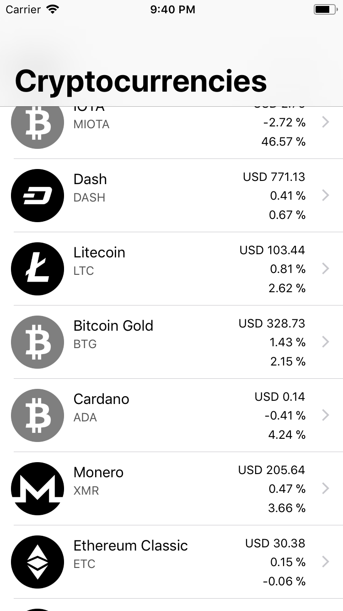

# CoinMarketCapApp

Sample app using RxSwift and Moya, consuming from the CoinMarketCap API.

The goal of this project is to develop a simple app exploring some concepts of iOS development, while using a few common libraries, such as RxSwift and Moya, by using the CoinMarketCap to track cryptocurrencies data.

# Resources

### Libraries

- [RxSwift](https://github.com/ReactiveX/RxSwift)
- [Moya](https://github.com/Moya/Moya)

### API

- [CoinMarketCap](https://coinmarketcap.com/api/)
